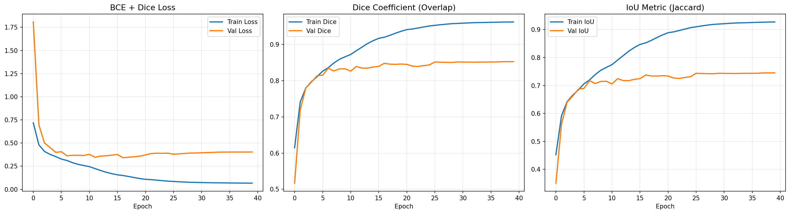
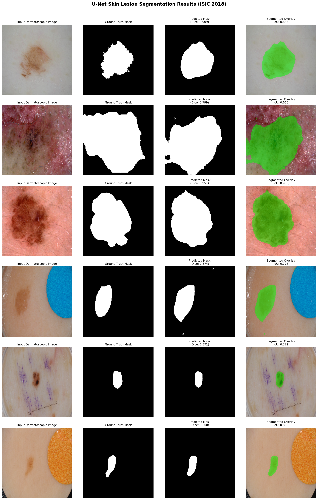
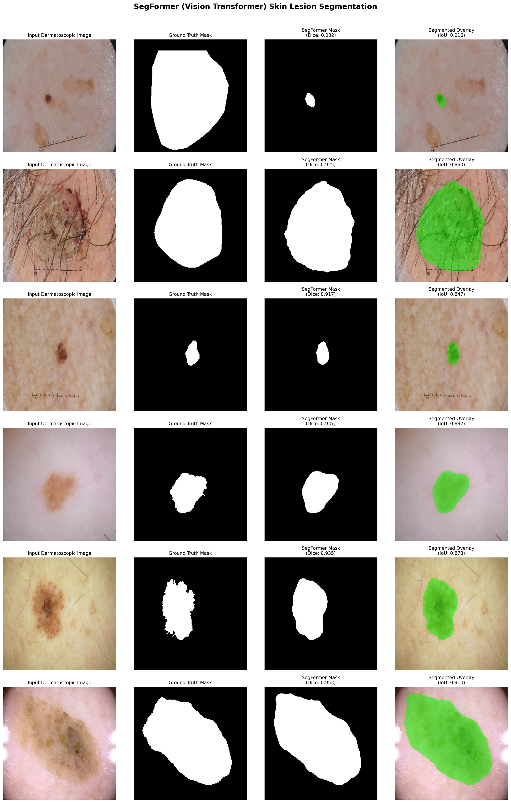

# 🧠 Medical Image Segmentation: U-Net vs Vision Transformers

> **Author:** Mahnoor ([@mahnoor-2722](https://github.com/mahnoor-2722))  
> **Domain:** Computer Vision · Healthcare AI · Medical Image Analysis  
> **Dataset:** ISIC 2018 Task 1 — Skin Lesion Segmentation (2,594 dermatoscopic images)


---

## 🌐 Live Demo

🔗 **[Try the Live Streamlit App](https://medical-image-segmentation-xaku9x6jg3eo5d89yxe8h3.streamlit.app/)*  

🔗 **[Model on Hugging Face Hub](https://huggingface.co/mahnoor-2722/isic-segformer)**

---

## 📌 Project Overview

An end-to-end benchmark study comparing a **Convolutional Neural Network (U-Net)** built from scratch in TensorFlow against a **Vision Transformer (SegFormer)** in PyTorch for pixel-level dermatoscopic skin lesion segmentation.

### 🎯 Research Questions
1. Can hierarchical **Vision Transformers** outperform CNN skip-connection architectures on medical lesion boundaries?
2. Can a **~3.7M-parameter Transformer** match or beat a **~31M-parameter U-Net**?
3. Does modern architecture design lead to both better accuracy **and** lower compute cost?

---

## 📊 Final Benchmark Results

| Model | Framework | Test/Val Dice | IoU (Jaccard) | Parameters | Status |
|:------|:---------:|:-------------:|:-------------:|:----------:|:------:|
| **U-Net (from scratch)** | TensorFlow | 85.26% | 74.53% | 31.05M | ✅ |
| **SegFormer MiT-B0** | PyTorch | **90.32%** | **82.50%** | ~3.7M | ✅ |
| **Improvement** | — | **+5.06%** | **+7.97%** | **~8× smaller** | 🏆 |

> **Winner: SegFormer** — higher spatial overlap accuracy while using ~88% fewer parameters.

---

## 🏗️ Architecture 1 — Custom U-Net (TensorFlow)

Built completely from scratch using a symmetric Encoder–Decoder structure with skip connections.

- **Encoder:** 4 contracting blocks (Conv2D → BN → ReLU → MaxPool)
- **Bottleneck:** 1024 filters at 16×16 resolution
- **Decoder:** 4 expanding blocks (ConvTranspose → Concat Skip → Conv2D)
- **Loss:** Binary Cross-Entropy + Dice Loss (combined)
- **Input:** 256×256×3

### 📈 Training Curves


### 🖼️ U-Net Segmentation Samples


---

## 🏗️ Architecture 2 — SegFormer Vision Transformer (PyTorch)

- **Backbone:** NVIDIA MiT-B0 (Mix Transformer, hierarchical self-attention)
- **Decoder:** Lightweight MLP head fusing multi-scale features
- **Pretrained:** ImageNet weights, then fine-tuned on ISIC 2018
- **Loss:** BCEWithLogits + Dice Loss (combined)
- **Framework:** PyTorch + Hugging Face `transformers`

### 🖼️ SegFormer Segmentation Samples


---

## 🛠️ Tech Stack

| Component | Tools |
|-----------|-------|
| Frameworks | TensorFlow 2.x, PyTorch |
| Architectures | Custom U-Net, SegFormer (`nvidia/mit-b0`) |
| Data Loading | OpenCV, Albumentations |
| Metrics | Dice Coefficient, IoU (Jaccard) |
| Hardware | NVIDIA T4 GPU (Google Colab) |
| Deployment | Streamlit Community Cloud |
| Model Hosting | [Hugging Face Hub](https://huggingface.co/mahnoor-2722/isic-segformer) |

---

## 📂 Repository Structure

```text
medical-image-segmentation/
├── app/
│   └── app.py                              # Streamlit web demo
├── notebooks/
│   ├── 01_baseline_unet_isic2018.ipynb     # TensorFlow U-Net training
│   └── 02_segformer_pytorch_isic2018.ipynb # PyTorch SegFormer training
├── results/
│   ├── eda_samples.png
│   ├── training_curves.png
│   ├── segmentation_results.png            # U-Net predictions
│   └── segformer_results.png               # SegFormer predictions
├── requirements.txt
├── README.md
└── .gitignore